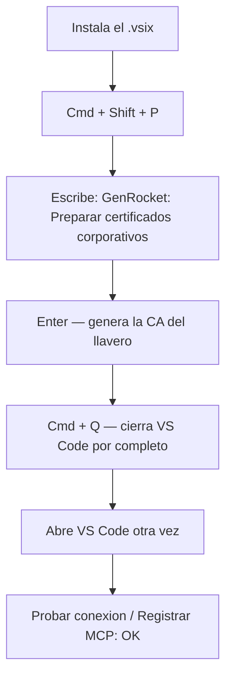

# GenRocket MCP — Extensión de VS Code

Lleva GenRocket a VS Code: **explorador** de proyectos/escenarios/chains/dominios/generadores, **descarga** de escenarios `.grs`, **ejecución del Runtime** para generar datos, **conexión a bases de datos** (Oracle/SQL Server, solo lectura), **generación de datos sintéticos** (Faker) y **publicación de la data a tus repos de GitHub** — todo expuesto como herramientas para el chat de IA (GitHub Copilot Chat) vía un **servidor MCP**.

Reúne en una sola extensión lo que antes vivía disperso: **configuración + tools + MCP + runtime + bases de datos + publicación**.

## Características

- **Explorador GenRocket** (barra lateral): proyectos → versión → Escenarios / Chains / Dominios → atributos → generadores.
- **Descargar escenario (.grs)** y **generar datos con el Runtime** local.
- **Autoría por REST**: crear dominios/atributos, agregar y parametrizar generadores, sugerir el generador adecuado por el nombre del atributo, y listar/crear receivers.
- **Vista previa por REST**: muestra datos de ejemplo de un dominio o atributo sin necesidad del Runtime (`domain/preview`).
- **Bases de datos (Oracle / SQL Server)**: varias conexiones, exploración en lenguaje natural y consultas **solo lectura**. El módulo de configuración **lista tus conexiones** con estado y botón de prueba.
- **Datos sintéticos con Faker**: genera datos falsos rápidos (JSON/CSV/Excel) sin GenRocket.
- **Sembrar datos reales + complemento sintético (Opción B)**: trae datos reales de la BD por `SELECT` (ej. pólizas) y completa cada fila con campos sintéticos (teléfono, email…).
- **Publicar a N repos**: sube la data generada (o un `.md` de contexto de un dominio) a uno o varios repositorios de GitHub con commit + push.
- **Servidor MCP**: registra todo en Copilot Chat para trabajar en lenguaje natural.
- **Credenciales seguras**: contraseñas en el **SecretStorage** de VS Code; el push usa tu **sesión de GitHub** de VS Code. Nada de tokens ni contraseñas en el repositorio.

## Subir mis cambios a GitHub (asistente paso a paso)

Comando **`GenRocket: Subir mis cambios a GitHub`** (o el ícono de subida en el explorador). Un asistente con 5 pasos:

1. **Conecta tu cuenta de GitHub** (login propio de VS Code; puedes cambiar de cuenta).
2. **Elige tu repositorio** de la lista de tus repos.
3. **Carpeta**: si ya lo tienes abierto lo usa; si no, lo **clona** por ti.
4. **Elige o crea una rama**.
5. **Escribe qué hiciste** y pulsa **Guardar y subir**.

No se guardan tokens: usa tu sesión de GitHub de VS Code para autenticar el push.

## Módulo de Base de Datos (consultas de solo lectura vía el agente)

Conecta a **Oracle** y **SQL Server** (varias bases, varias conexiones) y pregunta en lenguaje natural: *"dame los usuarios activos"*. El agente explora el esquema (tablas, columnas, índices) y arma el SQL.

- **Solo lectura**: únicamente `SELECT` (bloquea INSERT/UPDATE/DELETE/DDL).
- Usa **JDBC** con tus propios drivers (ojdbc para Oracle, mssql-jdbc para SQL Server): **no usa npm**.
- Requiere **Java** instalado y la ruta a tu driver `.jar`.
- El **módulo de configuración** (`GenRocket: Abrir configuración`) ahora **lista tus conexiones** registradas con su tipo, host/usuario, aviso de "sin contraseña" y un botón **Probar** por conexión, más un botón **Administrar bases de datos**.

**Configura las conexiones** en `Settings` → busca `genrocket.dbConnections` → "Edit in settings.json". Ejemplo:
```json
"genrocket.dbConnections": [
  { "name": "prod-oracle", "type": "oracle",
    "jdbcUrl": "jdbc:oracle:thin:@//host:1521/servicio", "user": "usuario",
    "driverJar": "C:\\drivers\\ojdbc11.jar" },
  { "name": "reportes-mssql", "type": "sqlserver",
    "jdbcUrl": "jdbc:sqlserver://host:1433;databaseName=MiBD;encrypt=true;trustServerCertificate=true", "user": "sa",
    "driverJar": "C:\\drivers\\mssql-jdbc-12.6.1.jre11.jar" }
]
```
La **contraseña no va aquí**: al registrar/iniciar el MCP, VS Code la pide por un input seguro (una por conexión).

> **Nota sobre GenRocket y las conexiones de BD:** GenRocket **no expone** por REST la lista de conexiones de base de datos dadas de alta en su plataforma (esas conexiones JDBC viven en la carpeta del Runtime). Por eso el plugin administra **sus propias** conexiones (las de arriba), que son las que el agente usa para traer datos reales.

**Tools MCP** (en Copilot Chat): `db_list_connections`, `db_test_connection`, `db_list_tables`, `db_describe_table`, `db_list_indexes`, `db_sample`, `db_query` — todas de solo lectura y con parámetro `connection` para elegir la base.

**Explorar la base (contexto para el agente):** `db_explore` analiza toda la conexión —tablas, columnas, claves primarias, **relaciones (FK)** e índices— y **genera un archivo Markdown por base de datos** (`db-context/<conexión>.md`) que el agente usa como contexto para construir consultas. `db_read_context` lo relee sin re-escanear. Pídele por ejemplo: _"explora la base ventas y arma el contexto"_. Opciones: `maxTables` (default 400) e `includeRowCounts` (COUNT(*) por tabla, más lento).

## Datos sintéticos rápidos (Faker)

Módulo independiente para generar **datos falsos** sin GenRocket ni BD, exportables a **JSON / CSV / Excel**. Útil para datos desechables de prueba.

- `faker_field_types`: lista los tipos disponibles (firstName, email, phone, date, integer, address, etc.).
- `faker_generate`: define columnas `{name, type}`, cantidad de filas y formato. Idioma `es` (México) por defecto.

Ejemplo en Copilot Chat: *"genera 50 usuarios con nombre, email, teléfono y edad entre 18 y 65 en Excel"*.

## Sembrar datos reales de la BD y publicar a repos (Opción B)

Combina **datos reales de tu base** con **complemento sintético** y súbelos a uno o varios repositorios en un solo paso. Es el caso típico: *tomar números y nombres de póliza reales y completar teléfono/email/dirección sintéticos*.

**Tool:** `seed_from_db_and_publish`

| Parámetro | Descripción |
|---|---|
| `connection` | Nombre de la conexión de BD (default: la primera). |
| `query` | `SELECT` que trae los datos reales (ej. `SELECT numero_poliza, nombre FROM polizas WHERE estatus='ACTIVA'`). Solo lectura. |
| `rename` | Renombra columnas de la BD en la salida, ej. `{"NUMERO_POLIZA":"policyNumber","NOMBRE":"policyHolder"}`. |
| `syntheticFields` | Campos sintéticos por fila: `[{name,type,min,max}]` (tipos de `faker_field_types`). |
| `limit` | Máximo de filas reales (default 500). |
| `format` | `csv` \| `json` \| `xlsx` (default csv). |
| `repos` | Destinos `[{repo:"owner/nombre", branch?, path}]`. **1..N repos.** Si se omite, solo genera el archivo (dry-run). |
| `commitMessage` | Mensaje de commit (opcional). |

**Relación N↔N:** una llamada puede subir a **varios repos** (varios destinos); y puedes tener **varias publicaciones** hacia el mismo repo con rutas distintas (varios dominios → un repo).

Ejemplo en Copilot Chat:
> *"Con la conexión prod-oracle, trae `SELECT numero_poliza, nombre FROM polizas WHERE estatus='ACTIVA'`, renombra a policyNumber/policyHolder, agrega telefono y email sintéticos, formato csv, y súbelo a `lrbg/appQA` en `test-data/polizas.csv` y a `lrbg/appRegresion` en `fixtures/polizas.csv`."*

Recomendación: primero haz un **dry-run** (sin `repos`) para revisar el archivo generado, y luego publica.

## Documentar un dominio como Markdown de contexto

Convierte un dominio de GenRocket en un `.md` que sirve de **contexto para el agente** (y para el equipo): atributos, una muestra de datos y, opcionalmente, los generadores de cada atributo. Puede publicarse a repo(s).

**Tool:** `domain_to_markdown` — parámetros: `projectName`, `domainName`, `version`, `sampleRows`, `includeGenerators`, `repos`.

Ejemplo: *"documenta el dominio Poliza del proyecto Prueba_APIS como markdown, con generadores, y súbelo a `lrbg/appQA` en `docs/genrocket/poliza.md`"*.

### Todos los dominios de un proyecto + detección de patrones

**Tool:** `project_domains_to_markdown` — genera un `.md` por **cada** dominio del proyecto, más un **índice** (`README.md`) con una tabla de dominios y una sección de **atributos compartidos entre dominios** (mismo nombre en dos o más dominios = posible relación o patrón). Publica todo a un repo en un solo commit. Parámetros: `projectName`, `version`, `domainNames` (filtro opcional), `sampleRows`, `includeGenerators`, `maxDomains`, `repos`, `basePath` (default `docs/genrocket`).

Ejemplo: *"documenta TODOS los dominios del proyecto UST_LOB_POC como contexto y súbelos a `lrbg/appQA` en docs/genrocket; quiero ver qué atributos comparten entre sí"*.

## Publicación a repos: cómo autentica

El MCP hace `commit` + `push` con **tu sesión de GitHub de VS Code**: al registrar el servidor MCP, el plugin inyecta tu token de GitHub en la configuración local del MCP (nunca en el repositorio). Requisitos:

1. Tener **GitHub conectado** en VS Code (Accounts).
2. Ejecutar **`GenRocket: Registrar servidor MCP`** (o guardar la configuración) para que el token quede disponible, y hacer **Restart** del MCP.

Si el token no está disponible, la tool lo indica y no sube nada. Los repos se clonan/actualizan en `~/GenRocketRepos`.

## Manager Dashboard (Directiva N.4)

Tablero para el manager, **protegido por palabra clave**. Ábrelo con el icono de gráfica del panel de GenRocket (o el comando `GenRocket: Manager Dashboard (Directiva N.4)`): pedirá una palabra clave y, si es correcta, abre el tablero.

- **Contraseña:** se valida contra un **hash** guardado en el SecretStorage de VS Code (nunca en el repositorio). Cámbiala con `GenRocket: Cambiar palabra clave del Dashboard`.
- **Qué muestra:** KPIs (datasets, filas, dominios, repos, usuarios, última actividad); **datos generados por dominio** (dona + tabla); **commits/publicaciones por usuario**; **actividad por usuario** (resumen corto y descriptivo); **salud** (errores recientes + conexiones de BD). El botón *Guardar .md* exporta el tablero con gráficas **mermaid**.
- **De dónde salen los datos:** un registro de actividad que el plugin escribe en cada siembra/contexto (usuario, dominio, filas, formato, repos).
- **Para todo el equipo:** configura `genrocket.dashboard.teamRepo` (owner/nombre) y `genrocket.dashboard.teamPath`; cada persona sincroniza su actividad como `<usuario>.jsonl` en ese repo y el tablero **agrega a todo el equipo**. Sin configurarlo, el tablero es local.

## Requisitos

- VS Code ^1.96
- Node.js 20+
- Java (para el Runtime **y** para el módulo de BD JDBC).
- El **GenRocket Runtime engine** instalado (software propietario de GenRocket) solo si vas a generar datos con el Runtime.

## Instalación (recomendada): desde el `.vsix` — sin npm

Ideal si tu red corporativa te da errores de certificado con npm (`unable to get local issuer certificate`). El `.vsix` ya trae todo (incluidas las dependencias del servidor MCP), así que **no necesitas `npm install`**.

1. Descarga el `.vsix` desde **[Releases](https://github.com/lrbg/genRocketMCP_PlugIn/releases)**.
2. En VS Code: **Extensions** → menú `···` (arriba a la derecha) → **Install from VSIX…** → elige el archivo.
3. Abre el panel **GenRocket** en la barra lateral y configura con el ícono de engrane.

### ¿Error "unable to get local issuer certificate" al conectar?

Es un proxy/CA corporativo que intercepta TLS (Zscaler / Netskope / CA de tu empresa). Node no confía en esa CA. Requiere la versión **v0.1.1 o superior** del `.vsix`.

**Un "comando" aquí es de la Paleta de Comandos de VS Code, NO de la terminal.** El comando detecta tu sistema operativo automáticamente.

**macOS:**
1. Presiona **`Cmd + Shift + P`**.
2. Escribe **`GenRocket: Preparar certificados corporativos`** y pulsa **Enter**.
3. Sale el aviso → **cierra VS Code por completo con `Cmd + Q`** y ábrelo de nuevo.
4. Vuelve a **Probar conexión** o a **Registrar el MCP**.

**Windows:**
1. Presiona **`Ctrl + Shift + P`**.
2. Escribe **`GenRocket: Preparar certificados corporativos`** y pulsa **Enter**.
3. Sale el aviso → **cierra VS Code por completo** (todas las ventanas) y ábrelo de nuevo.
4. Vuelve a **Probar conexión** o a **Registrar el MCP**.

En ambos, el comando exporta la CA de confianza del sistema (macOS = llavero; Windows = almacén de certificados Root) y configura `NODE_EXTRA_CA_CERTS`. El MCP ya incluye esa CA automáticamente.

> Si no ves el comando al escribir "GenRocket", instala primero la **v0.1.1** desde [Releases](https://github.com/lrbg/genRocketMCP_PlugIn/releases) (la v0.1.0 no lo trae).



<!-- CAPTURAS: si quieres imágenes reales, colócalas en docs/images/ y descoméntalo:


-->

No se apaga la verificación TLS: solo se confía en la CA que tu empresa ya instaló en tu llavero de macOS.

**Diagnóstico opcional (esto SÍ es en la terminal)** — para ver qué CA te intercepta:
```bash
echo | openssl s_client -connect app.genrocket.com:443 2>/dev/null | grep " i:"
```

**Alternativa manual** (solo si vas a usar npm compilando desde el código):

macOS / Linux (terminal):
```bash
security find-certificate -a -p /Library/Keychains/System.keychain > ~/corp-cacerts.pem
security find-certificate -a -p /System/Library/Keychains/SystemRootCertificates.keychain >> ~/corp-cacerts.pem
npm config set cafile ~/corp-cacerts.pem
export NODE_EXTRA_CA_CERTS=$HOME/corp-cacerts.pem
```

Windows (PowerShell):
```powershell
Get-ChildItem Cert:\LocalMachine\Root, Cert:\CurrentUser\Root | ForEach-Object {
  '-----BEGIN CERTIFICATE-----'
  [Convert]::ToBase64String($_.RawData, 'InsertLineBreaks')
  '-----END CERTIFICATE-----'
} | Out-File -Encoding ascii "$HOME\corp-cacerts.pem"
npm config set cafile "$HOME\corp-cacerts.pem"
setx NODE_EXTRA_CA_CERTS "$HOME\corp-cacerts.pem"
```

## Instalación (desde el código)

```bash
npm install            # dependencias de la extensión
npm run compile        # compila TypeScript a ./out
(cd mcp && npm install) # dependencias del servidor MCP
```

Luego abre la carpeta en VS Code y pulsa **F5** (Extension Development Host), o empaqueta tu propio `.vsix`:

```bash
npm run package        # genera el .vsix (requiere @vscode/vsce)
```

## Configuración

Cada usuario configura **sus propios datos**. La forma más clara es la **ventana de configuración**: comando **`GenRocket: Abrir configuración`** (o el ícono de engrane en el panel del explorador). Ahí pones tenant, usuario, contraseña, org id y el comando del Runtime, con botones para **probar conexión** y **registrar el MCP**, además de la **lista de tus bases de datos** con prueba por conexión.

- La **contraseña** se guarda cifrada en el **SecretStorage** de VS Code — nunca en el repositorio ni en texto plano.
- El **chat de IA** usa **tu propia suscripción de GitHub Copilot**; la extensión no guarda tokens de Copilot ni de OpenAI.
- El **push a repos** usa tu **sesión de GitHub** de VS Code (token inyectado en la config local al registrar el MCP; nunca en el repo).
- Nada viene precargado con datos de otra organización: los valores por defecto son genéricos y **editables** por el usuario.

También puedes editar todo desde `Settings → GenRocket MCP`:

| Ajuste | Descripción |
|---|---|
| `genrocket.baseUrl` | Host/tenant de tu organización, ej. `https://TU-ORG.genrocket.com` |
| `genrocket.username` | Usuario (email) |
| `genrocket.organizationId` | Organization external ID |
| `genrocket.runtimeCommand` | Comando del Runtime, con `{grs}` y `{dir}`. Ej: `java -jar /ruta/GenRocketRuntime.jar {grs}` |
| `genrocket.runtimeOutputDir` | Carpeta de salida del Runtime (vacío = temporal) |
| `genrocket.dbConnections` | Conexiones Oracle/SQL Server (ver sección Base de Datos) |

La **contraseña** de GenRocket se guarda con el comando **`GenRocket: Set Password`** (Command Palette).

## Usar el chat de IA (MCP)

1. Ejecuta el comando **`GenRocket: Registrar servidor MCP (Copilot Chat)`**. Escribe `.vscode/mcp.json` apuntando a la config local (incluye tu token de GitHub para el push).
2. Abre `.vscode/mcp.json` y pulsa **Start** (o **Restart** si ya estaba corriendo) en el servidor `genrocket`.
3. En Copilot Chat pídele, por ejemplo: *"lista los dominios del proyecto UST_LOB_POC v2.0"*, *"genera 100 pólizas reales + teléfono/email sintéticos y súbelas a mi repo de QA"* o *"documenta el dominio X como markdown"*.

> Cada vez que cambies configuración, credenciales, conexiones de BD o tu cuenta de GitHub, vuelve a **Registrar el MCP** y haz **Restart** para que tome los cambios.

## Herramientas MCP

**GenRocket — consulta:** `genrocket_test_connection`, `genrocket_list_scenarios`, `genrocket_list_chains`, `genrocket_list_domains`, `genrocket_list_generators`.

**GenRocket — vista previa (genera muestra por REST, sin Runtime):** `genrocket_preview_domain`, `genrocket_preview_attribute`.

**GenRocket — autoría y generadores:** crear dominio/atributos, **asignar un generador a un atributo** (`genrocket_assign_generator`: valida el nombre contra el catálogo real y sugiere parecidos; reemplaza el generador actual y acepta parámetros), agregar y parametrizar generadores, sugerir generador por nombre de atributo, ver el catálogo (`genrocket_available_generators`), listar/crear receivers. **Para saber los nombres EXACTOS de parámetros de un generador** (y no adivinar): `genrocket_generator_parameters` lista los generadores asignados a un atributo con sus parámetros reales y sus valores, tal como los expone GenRocket — úsalo antes de `genrocket_set_generator_parameter`.

**GenRocket — descarga y ejecución:** `genrocket_download_scenario`, `genrocket_run_scenario`, ejecución de chains y estado del Runtime (`genrocket_runtime_status`). Las tools del Runtime devuelven `stdout`/`stderr` para ver la causa real de un fallo (licencia, POI, etc.).

**Contexto y diagnóstico:** `genrocket_context` carga en el agente un Markdown con el funcionamiento de la API, sus errores conocidos y un playbook síntoma→herramienta (mejora el entendimiento y la detección de bugs; el MCP también lo anuncia como `instructions` al conectarse). `genrocket_runtime_doctor` diagnostica de un tiro Java, el Runtime, jars de Apache POI/xmlbeans duplicados, el perfil/certificado de licencia en `~/.genrocket` y el `driverJar` de cada conexión. Puedes añadir contexto propio del proyecto con la variable `GENROCKET_CONTEXT_FILE` (ruta a un `.md`). **Log:** el MCP registra cada llamada REST (path/status/errores) y los errores de tools en un archivo (`GENROCKET_LOG_FILE`, por defecto en la carpeta temporal); léelo con `genrocket_read_log` para diagnosticar sin adivinar.

**GenRocket — crear escenario:** `genrocket_create_scenario` crea un escenario en un proyecto/versión, ligando un dominio como Scenario Domain (`POST /scenario/create`). La respuesta y cualquier error quedan en el log para afinar el payload según tu tenant.

**Bases de datos (solo lectura):** `db_list_connections`, `db_test_connection`, `db_list_tables`, `db_describe_table`, `db_list_indexes`, `db_sample`, `db_query`, `db_explore` (analiza el esquema completo y genera un `.md` de contexto por base), `db_read_context`.

**Datos sintéticos (Faker):** `faker_field_types`, `faker_generate`.

**Siembra + publicación:** `seed_from_db_and_publish` (datos reales + sintéticos → csv/json/xlsx → push a N repos), `domain_to_dataset` (un dominio → datos reales por `domain/preview` → csv/json/xlsx → push opcional), `domain_to_markdown` (un dominio → `.md` de contexto), `project_domains_to_markdown` (todos los dominios de un proyecto → un `.md` por dominio + índice con patrones → push opcional).

**Skills incluidas:** `list_skills` (lista las skills empaquetadas) y `get_skill` (devuelve las instrucciones completas de una skill). El plugin trae varias **skills** (guías de trabajo) empaquetadas que el agente puede tomar por el MCP; ver la sección siguiente.

**Graph-RAG local (sin LLM):** `index_docs` (indexa una carpeta de documentos: pasajes + grafo de conceptos) y `query_docs` (recupera los pasajes relevantes + conceptos relacionados para que Copilot redacte). 100% determinista, sin API keys ni Python; ver la sección siguiente.

## Skills empaquetadas (para el agente vía MCP)

El plugin incluye, dentro del `.vsix`, un conjunto de **skills** (guías de trabajo en Markdown, en `mcp/skills/`). El servidor MCP las expone al agente (Copilot Chat) con dos tools:

- **`list_skills`** — lista el nombre y la descripción de cada skill.
- **`get_skill`** (`name`) — devuelve el contenido completo de esa skill para que el agente la siga; si la skill trae scripts/archivos, incluye sus rutas (empaquetadas en la extensión).

Skills incluidas: `writing-plans` (planear antes de codear), `sql-optimization` (tuning de consultas SQL), `generate-synthetic-data` (datos sintéticos para evaluar pipelines de IA), `ocr-document-processor` (OCR de escaneos/PDFs), `docx` (crear/editar documentos Word) y `business-analyst` (historias de usuario, criterios de aceptación, análisis de requerimientos).

> Las skills provienen de repositorios de terceros y **corren con los permisos completos del agente**. Revísalas (`mcp/skills/<nombre>/SKILL.md`) antes de usarlas en trabajo sensible.

## Graph-RAG local (sin LLM ni API keys)

Búsqueda tipo *graph-RAG* sobre una carpeta de documentos, **100% determinista y local**. No usa ningún modelo: hace el trabajo determinista (indexar, construir un grafo de conceptos, recuperar pasajes) y le entrega el contexto al agente (Copilot), que redacta la respuesta — igual que el resto de las tools.

**Panel de configuración:** hay un icono de **librería** (📚) en la barra del explorador de GenRocket → abre el panel **"RAG de documentos"** donde eliges la carpeta (con "Examinar…"), le das **Indexar ahora** y ves el estado del índice (archivos, pasajes, conceptos, saltados). El índice se guarda en el mismo lugar que lee el MCP, así lo indexado desde el panel queda disponible para `query_docs` en Copilot.

- **`index_docs(folder)`** — indexa los documentos de una carpeta **extrayendo el texto de cada tipo**: **Word (.docx)**, **PDF**, **Excel (.xlsx)**, HTML y texto/código (md, txt, csv, json…). Los parte en pasajes y arma un **grafo de conceptos por co-ocurrencia** (BM25 para el ranking, grafo para las relaciones). Guarda un índice "activo". Ideal para una **carpeta de SharePoint descargada a local**.
- **`query_docs(query, k?)`** — recupera los `k` pasajes más relevantes (BM25) más los **conceptos relacionados** del grafo, y los devuelve para que el agente responda citando cada archivo.

No requiere Python, ni la librería de Microsoft GraphRAG, ni una API key: por eso funciona con Copilot exactamente como el plugin ya trabaja (Copilot razona; las tools solo recuperan contexto). Para RAG con extracción de entidades por LLM a gran escala, usa la librería de Microsoft GraphRAG por separado (requiere Python + un LLM con cuota).

## SharePoint por Microsoft Graph (lectura)

Para leer documentos directamente de SharePoint **sin sincronizar a local** (respetando lo colaborativo), el plugin usa **Microsoft Graph** con **auth-code + el navegador del sistema** (no device code): así el navegador presenta la **sesión de Windows/Entra** del equipo, incluido el claim de **dispositivo administrado** que suelen exigir las políticas de Conditional Access. (El proveedor de Microsoft integrado de VS Code no sirve: no puede pedir scopes de SharePoint — da `AADSTS65002`.)

1. En VS Code ejecuta el comando **"GenRocket: Conectar SharePoint (Microsoft)"** — abre el navegador en el login de Microsoft; inicia sesión con tu cuenta de la organización (usa el SSO del equipo). El token de Graph se guarda cifrado (SecretStorage) y se renueva solo con el refresh token.
2. En Copilot Chat usa la tool **`sharepoint_test_connection(siteUrl)`** — resuelve el sitio y lista sus bibliotecas y el contenido de la raíz. Sirve para **confirmar que el tenant permite leer el sitio** antes de indexar.

**Client / tenant** (settings, con defaults que funcionan en muchos tenants):
- `genrocket.graph.clientId` — default el de **Microsoft Graph PowerShell** (`14d82eec-…`), un cliente público preconsentido en muchas organizaciones. Si tu empresa te da una **App Registration propia** con `Sites.Read.All`, pon aquí su client ID.
- `genrocket.graph.tenantId` — default `organizations`; pon el Directory (tenant) ID si el login no resuelve tu tenant.

> **El acceso final lo decide el Azure AD de la organización.** Si el tenant bloquea el device code o no consiente esos permisos, la tool lo dice claramente y hay que habilitarlo con IT (App Registration + admin consent). El token vive local (cifrado), **nunca en el repo**. El indexado de esos documentos (extracción de docx/pdf/xlsx) hacia el graph-RAG es el siguiente paso, una vez confirmado el acceso.

## Notas sobre GenRocket

- El plugin puede **autoría básica por REST** (crear dominios, atributos, agregar y parametrizar generadores, receivers). El diseño avanzado sigue siendo más cómodo en el **GenRocket Designer**.
- La **vista previa** (`domain/preview`) genera una muestra por REST; para **volumen completo con receivers** se usa el **GenRocket Runtime** con la definición `.grs`.
- GenRocket **no expone** por REST la lista de conexiones de BD de su plataforma (viven en la carpeta JDBC del Runtime). La integración BD→GenRocket nativa se hace con los generadores de consulta (familia `Query*`), que requieren el Runtime + su configuración JDBC.
- Al **asignar un generador**, el `genType` debe ser un nombre del **catálogo real de tu organización** (`genrocket_available_generators`); no hay nombres genéricos garantizados (p.ej. puede no existir `FirstNameGen`). `genrocket_assign_generator` valida el nombre y te sugiere los parecidos.

## Hallazgos validados de la API (contexto para el agente)

Comportamientos reales de la Web REST API de GenRocket, verificados contra un tenant Cloud (v3.12). Útiles para que el agente no repita errores:

- **Auth**: `POST /rest/login` devuelve el JWT en el **body como `accessToken`** (no en header). Las llamadas autenticadas usan el header **`x-auth-token`**; con `Authorization: Bearer` responde **401 "Missing issuer claim"**.
- **Asignar generador = borra primero.** `POST /rest/generator/add` sobre un atributo que **ya tiene** generador **cuelga el servidor y devuelve 500** (página HTML). Hay que hacer `POST /rest/generator/deleteAll` **antes**. Las tools `genrocket_add_generator`, `genrocket_assign_generator` y `create_attribute_with_generator` ya lo hacen (reemplazan). Con el atributo vacío, el `add` responde en ~400 ms.
- **Nombres de generador**: salen del catálogo `POST /rest/generators/list` (cientos por organización, muchos regionales). Un nombre inválido devuelve `success:false "Invalid Generator Name"` (no 500). Usa `genrocket_available_generators` / `genrocket_assign_generator` (valida y sugiere).
- **Errores lógicos ≠ HTTP error**: la API suele responder **HTTP 200 con `{ success:false, errors:{...} }`** (domainId/atributo/generador no encontrado). Trátalos como error aunque el status sea 200.
- **Nombres de endpoint**: para leer un ítem es **`/show`**, no `/get` ni `/list`. Existen y están validados: `project/list`, `projectVersion/show`, `domain/show` (trae atributos **con** sus generadores), `domain/list`, `scenario/list`, `chain/list`. **No** existen en este tenant: `project/get`, `domain/get`, `attribute/list`, `scenario/get` (404). `attribute/show` dio 404 aquí → usa `domain/show` para ver atributos.
- **Nombre EXACTO del proyecto**: usa `genrocket_list_projects` antes de listar dominios/escenarios. Un nombre mal escrito (p.ej. un guión bajo de más) hace que `domain/list` devuelva 0 dominios y el flujo termine en un error confuso.
- **Generación por REST**: solo `domain/preview` (muestras chicas, sin Runtime). **No hay generación masiva por REST** en este tenant (endpoints `*/generate` = 404; DataConnect "10k por llamada" no está expuesto por REST). Para volumen: **GenRocket Runtime** con la definición `.grs`.
- Los servicios de descripción de generadores bajo **`/ws/generators*`** existen pero requieren **otra credencial** (dan 401 con `x-auth-token` y con Basic) — probablemente un API key de la organización.

## Licencia

MIT
